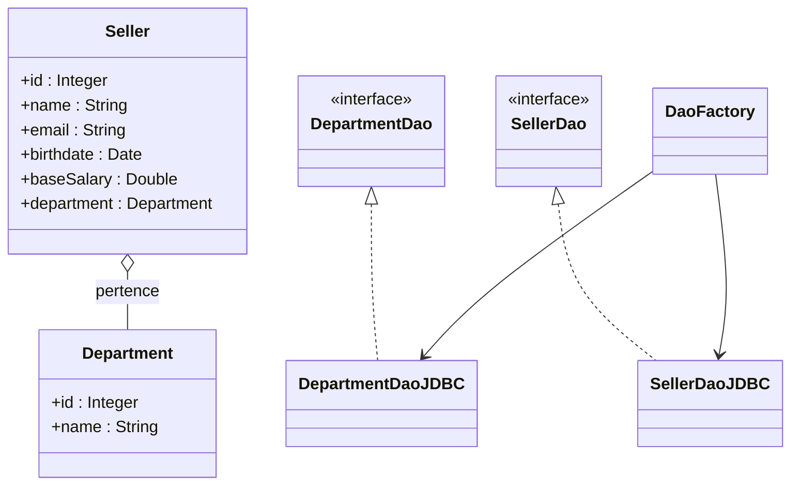

# 🗄️ Projeto DAO com JDBC

Este projeto demonstra a implementação do **DAO (Data Access Object)** em Java utilizando **JDBC** para interação com banco de dados relacional.  
O objetivo é aplicar boas práticas de arquitetura, separando a lógica de acesso a dados da lógica de negócio.

---

## 📂 Estrutura do Projeto

```
project-root/
 ├── src/
 │    ├── application/
 │    │    ├── Program.java        # Testes com entidade Seller
 │    │    └── Program2.java       # Testes com entidade Department
 │    │
 │    ├── db/
 │    │    ├── DB.java             # Gerencia conexão JDBC e utilitários
 │    │    ├── DbException.java    # Exceção personalizada para erros de DB
 │    │    └── DbIntegrityException.java # Exceção para integridade referencial
 │    │
 │    ├── model/
 │    │    ├── dao/
 │    │    │    ├── DaoFactory.java        # Fábrica de DAOs
 │    │    │    ├── DepartmentDao.java     # Interface DAO Department
 │    │    │    ├── SellerDao.java         # Interface DAO Seller
 │    │    │    └── impl/
 │    │    │         ├── DepartmentDaoJDBC.java # Implementação JDBC Department
 │    │    │         └── SellerDaoJDBC.java     # Implementação JDBC Seller
 │    │    │
 │    │    └── entities/
 │    │         ├── Department.java        # Entidade Department
 │    │         └── Seller.java            # Entidade Seller
 │
 ├── sql/
 │    └── schema.sql              # Script de criação do banco e tabelas
 │
 ├── db.properties                # Configuração de conexão JDBC
 └── README.md
```

---

## 🛠️ Tecnologias Utilizadas

- **Java SE**  
- **JDBC** (Java Database Connectivity)  
- **MySQL** (Banco de dados relacional utilizado neste projeto)  

---

## ⚙️ Funcionalidades

### Entidade **Seller**
- `findById` → Busca vendedor por ID  
- `findByDepartment` → Lista vendedores de um departamento  
- `findAll` → Lista todos os vendedores  
- `insert` → Insere novo vendedor  
- `update` → Atualiza dados de um vendedor  
- `deleteById` → Remove vendedor por ID  

### Entidade **Department**
- `findById` → Busca departamento por ID  
- `findAll` → Lista todos os departamentos  
- `insert` → Insere novo departamento  
- `update` → Atualiza dados de um departamento  
- `deleteById` → Remove departamento por ID  

---

## 📑 Exemplo de Uso

### Testando Seller (Program.java)
```java
SellerDao sellerDao = DaoFactory.createSellerDao();

// Buscar por ID
Seller seller = sellerDao.findById(3);
System.out.println(seller);

// Inserir novo vendedor
Seller newSeller = new Seller(null, "Greg", "greg@gmail.com", new Date(), 4000.0, department);
sellerDao.insert(newSeller);
System.out.println("Inserted new id = " + newSeller.getId());
```

### Testando Department (Program2.java)
```java
DepartmentDao departmentDao = DaoFactory.createDepartmentDao();

// Buscar por ID
Department department = departmentDao.findById(4);
System.out.println(department);

// Inserir novo departamento
Department newDepartment = new Department(null, "Music");
departmentDao.insert(newDepartment);
System.out.println("Inserted! New id: " + newDepartment.getId());
```

---

## 📌 Observações Importantes

- O projeto foi desenvolvido para **MySQL**. Certifique-se de ter o MySQL instalado e rodando localmente.  
- O usuário deve **criar um banco de dados chamado `coursejdbc`** antes de rodar o projeto.  
- O arquivo `db.properties` deve conter as credenciais de conexão com o banco de dados:
  ```properties
  user=seuUsuario
  password=suaSenha
  dburl=jdbc:mysql://localhost:3306/coursejdbc
  useSSL=false
  ```
- Substitua `seuUsuario` e `suaSenha` pelas credenciais do seu banco local.  
- O script SQL para criação do banco está disponível em **`sql/schema.sql`**.  

---

## 🗄️ Script de Criação do Banco (`sql/schema.sql`)

```sql
CREATE DATABASE coursejdbc;

USE coursejdbc;

CREATE TABLE department (
  Id int(11) NOT NULL AUTO_INCREMENT,
  Name varchar(60) DEFAULT NULL,
  PRIMARY KEY (Id)
);

CREATE TABLE seller (
  Id int(11) NOT NULL AUTO_INCREMENT,
  Name varchar(60) NOT NULL,
  Email varchar(100) NOT NULL,
  BirthDate datetime NOT NULL,
  BaseSalary double NOT NULL,
  DepartmentId int(11) NOT NULL,
  PRIMARY KEY (Id),
  FOREIGN KEY (DepartmentId) REFERENCES department (Id)
);

INSERT INTO department (Name) VALUES 
  ('Computers'),
  ('Electronics'),
  ('Fashion'),
  ('Books');

INSERT INTO seller (Name, Email, BirthDate, BaseSalary, DepartmentId) VALUES 
  ('Bob Brown','bob@gmail.com','1998-04-21 00:00:00',1000,1),
  ('Maria Green','maria@gmail.com','1979-12-31 00:00:00',3500,2),
  ('Alex Grey','alex@gmail.com','1988-01-15 00:00:00',2200,1),
  ('Martha Red','martha@gmail.com','1993-11-30 00:00:00',3000,4),
  ('Donald Blue','donald@gmail.com','2000-01-09 00:00:00',4000,3),
  ('Alex Pink','bob@gmail.com','1997-03-04 00:00:00',3000,2);
```

---

## 📊 Diagrama UML Organizado



---

## 🎯 Objetivo

Este projeto é voltado para **aprendizado de JDBC e boas práticas de arquitetura em Java**, servindo como base para aplicações maiores que necessitem de persistência em banco de dados.

---
